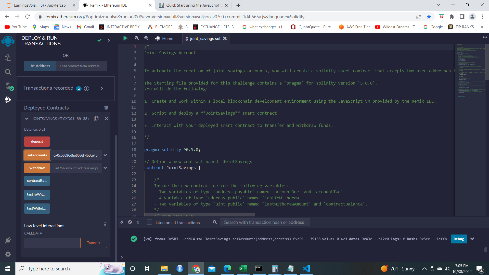
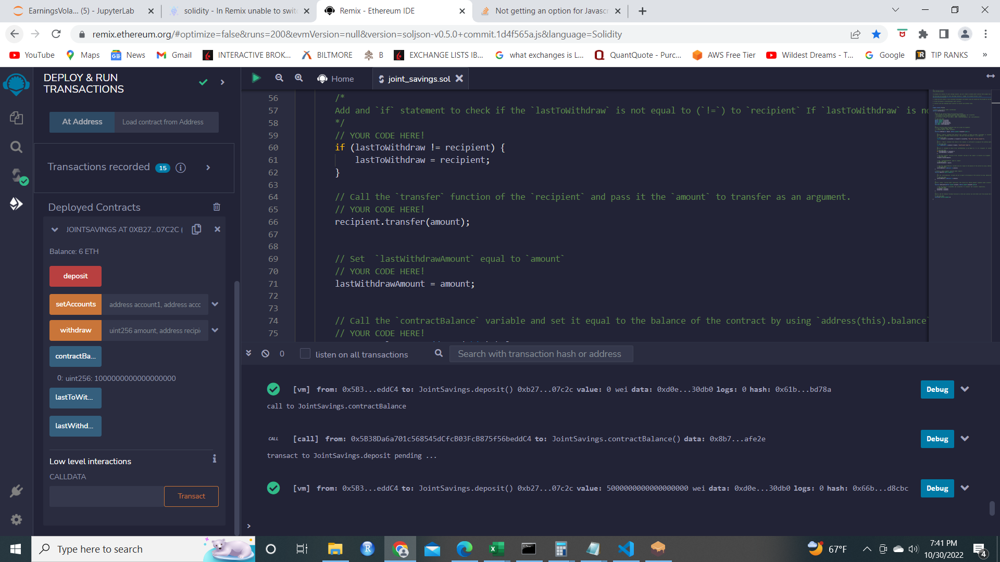
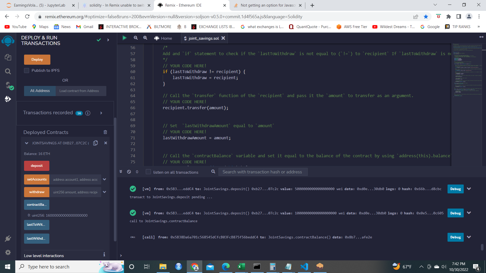
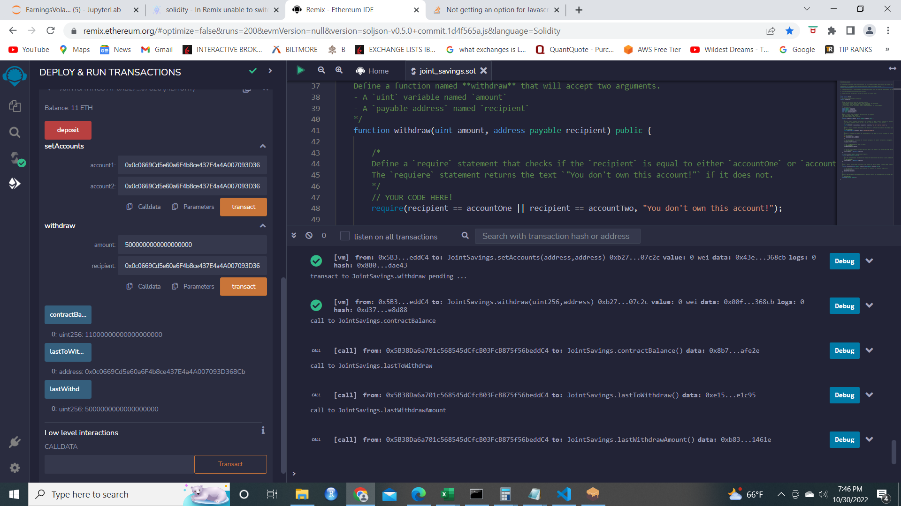

# Smart Contract Deposits and Withdrawals

The application in 'joint_savings.sol' contains a smart contract developed on [REMIX's IDE ](www.remix.org) that enables the user to deposit and withdraw cryptocurrency between two different wallet addresses (and the smart contract itself). 

## Installation Guide

Downloading the code & associated files using `git clone` from the repository is sufficient to download the Jupyter Notebook, ensure that the associated libaries (see Technologies section) are installed on your machine as well.  

# Functions

The screenshots in the 'Screenshots' folder demonstrate the successful usage of functions in the smart contract:  

Checking the initial contract balance  (0 Ether):

Setting the account addresses (given in online material):

Depositing 1 Ether to the smart contract as wei: 

Depositing 5 Ether to the smart contract: 

Depositing 10 Ether to the smart contract as wei: 

Withdrawing 5 Ether from the smart contract to account 1:

Withdrawing 10 Ether from the smart contract to account 2: 

## Usage

Logging on to the REMIX IDE [REMIX IDE](https://remix.ethereum.org), you should be able to copy and paste the 'joint_savings.sol' file into your workspace, build, and deploy the contract with relative ease. .

## Contributors

Project contributors are the Rice FinTech bootcamp program team (instructor Eric Cadena) who developed the tasks for this project along with myself (Paula K) who's written the code in the workbook.
